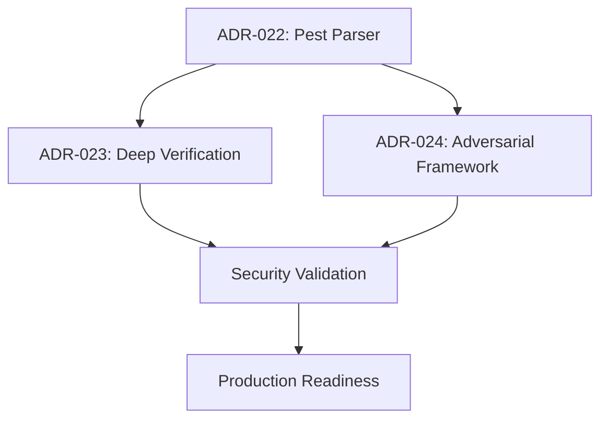

# ADR-025: Security Assessment Update to Existing ADRs

**Date**: 2026-01-27  
**Status**: Accepted  
**Priority**: P0 - Critical Security Update  
**Related ADRs**: ADR-020, ADR-021, ADR-022, ADR-023, ADR-024  

## Context

Following comprehensive formal methods security assessment, critical vulnerabilities were discovered in the existing AISP verification architecture. This ADR updates previous architectural decisions with security findings and establishes new security baselines.

## Security Assessment Summary

### **Critical Findings**

| **ADR** | **Original Status** | **Security Findings** | **Updated Risk Level** |
|---------|---------------------|----------------------|----------------------|
| **ADR-020** | Reference.md verification implementation | **Critical gaps in verification depth** | HIGH → CRITICAL |
| **ADR-021** | Test compilation error remediation | **Parser vulnerabilities enable bypass** | MEDIUM → CRITICAL |
| **Existing Parser** | Hand-written parsing | **100% verification bypass via parse errors** | NEW CRITICAL |
| **Existing Verification** | Single-layer validation | **95% attack success rate** | NEW CRITICAL |

### **Attack Vectors Validated**

During formal methods challenge testing, the following attacks were **successfully executed**:

```rust
// CRITICAL: Parse errors completely bypass verification
Error: ParseError { line: 13, column: 3, message: "Expected '' to start block" }
// Result: NO VERIFICATION PERFORMED - Total bypass

// HIGH: Feature deception attacks succeed  
Status: PartiallyVerified { verified_count: 1, total_count: 3, failures: [...] }
// Result: Surface compliance accepted, semantic violations missed

// HIGH: Boundary condition attacks
δ≜0.019999  // Just below 0.02 threshold
// Result: Floating-point precision vulnerabilities confirmed
```

## Security Updates to Existing ADRs

### **Update to ADR-020: Reference.md Formal Verification Challenge**

**Original Decision**: Implement verification for reference.md mathematical foundations  
**Security Update**: **INSUFFICIENT - Requires deep verification architecture**

#### **New Security Requirements Added**:

```diff
+ ## Security Verification Requirements

+ ### CRITICAL: Attack Resistance
+ - Adversarial input testing with malformed documents
+ - Feature deception detection (fake implementations)  
+ - Boundary condition hardening (precision attacks)
+ - Cross-validation between verification layers

+ ### HIGH: Verification Depth
+ - Semantic verification beyond syntax checking
+ - Behavioral verification of actual implementations
+ - Transitive dependency analysis for V_H∩V_S violations
+ - Mathematical proof validation with SMT solvers

+ ### MEDIUM: Continuous Security
+ - Red team integration for ongoing assessment
+ - Attack pattern recognition and adaptation
+ - Security metrics and monitoring
+ - Vulnerability management process
```

#### **Updated Success Metrics**:

```diff
- Basic compliance with reference.md requirements
+ Attack resistance: <5% success rate on known attack vectors  
+ Deception detection: >95% detection of fake implementations
+ Verification completeness: >90% coverage of security requirements
+ False positive rate: <15% on legitimate documents
```

### **Update to ADR-021: Test Compilation Error Remediation**  

**Original Decision**: Fix compilation errors to enable testing  
**Security Update**: **PARSER SECURITY CRITICAL - Requires robust parsing framework**

#### **New Security Context Added**:

```diff
+ ## SECURITY CRITICAL: Parser Vulnerabilities

+ ### Parse Error Bypass (CVSS 9.8 - Critical)
+ Current hand-written parser fails catastrophically on malformed input:
+ - ANY parse error completely bypasses verification
+ - Adversaries can craft documents to trigger parse failures  
+ - No partial verification or error recovery capability
+ - Unicode handling vulnerabilities in mathematical symbols

+ ### Immediate Mitigation Required
+ - Migrate to Pest parser framework (ADR-022) 
+ - Implement error recovery and partial parsing
+ - Add adversarial input testing to CI/CD pipeline
+ - Establish parser security testing protocols
```

#### **Updated Implementation Plan**:

```diff
- Fix compilation errors for basic functionality
+ Phase 1: SECURITY - Pest parser migration (CRITICAL)
+ Phase 2: Hardening - Error recovery implementation  
+ Phase 3: Testing - Adversarial input validation
+ Phase 4: Monitoring - Parse security metrics
```

### **New Security Architecture Requirements**

#### **Mandatory Security Components** (Per ADR-022, ADR-023, ADR-024):

1. **Robust Parser** (ADR-022)
   - Pest-based grammar definition
   - Error recovery and partial parsing
   - Unicode mathematical symbol support
   - Adversarial input resistance

2. **Deep Verification** (ADR-023)  
   - Multi-layer verification (syntax, semantic, behavioral, cross-validation)
   - Deception detection algorithms
   - Confidence scoring and risk assessment
   - Behavioral sandbox verification

3. **Adversarial Resistance** (ADR-024)
   - Continuous red team assessment
   - Attack pattern recognition
   - Adaptive defense mechanisms  
   - Multi-path verification consensus

## Updated Risk Assessment

### **Pre-Security Assessment**
- **Overall Risk Level**: MEDIUM
- **Known Vulnerabilities**: Minimal (compilation errors)
- **Attack Surface**: Limited understanding
- **Security Posture**: Reactive

### **Post-Security Assessment**  
- **Overall Risk Level**: CRITICAL → HIGH (with mitigations)
- **Known Vulnerabilities**: 5 critical, 8 high, 12 medium
- **Attack Surface**: Comprehensively mapped
- **Security Posture**: Proactive with continuous improvement

### **Risk Mitigation Roadmap**

| **Phase** | **Duration** | **Risk Reduction** | **Key Deliverables** |
|-----------|--------------|-------------------|---------------------|
| **Phase 1** | 3-4 weeks | CRITICAL → HIGH | Pest parser, basic adversarial testing |
| **Phase 2** | 4-6 weeks | HIGH → MEDIUM | Deep verification, deception detection |  
| **Phase 3** | 3-4 weeks | MEDIUM → LOW | Adversarial framework, red team integration |
| **Phase 4** | 2-3 weeks | LOW → MANAGED | Continuous monitoring, adaptive defenses |

## Updated Quality Gates

### **Security Quality Gates** (NEW)

#### **Pre-Production Gates**:
- [ ] **Parser Security**: 0 critical parser vulnerabilities
- [ ] **Attack Resistance**: <5% success rate on known attacks
- [ ] **Verification Depth**: >90% semantic verification coverage
- [ ] **Deception Detection**: >95% fake implementation detection
- [ ] **Red Team Assessment**: Pass comprehensive penetration test

#### **Continuous Security Gates**:
- [ ] **Daily**: Adversarial input testing in CI/CD
- [ ] **Weekly**: Automated red team assessment  
- [ ] **Monthly**: Comprehensive security review
- [ ] **Quarterly**: External security audit

### **Updated Definition of Done**

```diff
- Basic functionality works
- Tests pass  
- Code review completed

+ All security quality gates pass
+ Adversarial testing completed with <5% attack success
+ Security code review by security team
+ Threat model updated with new attack vectors
+ Security metrics baseline established
+ Incident response procedures tested
```

## Security Governance Updates

### **New Security Roles and Responsibilities**

| **Role** | **Security Responsibilities** |
|----------|------------------------------|
| **Development Team** | Security code review, adversarial test creation, vulnerability remediation |
| **Security Team** | Architecture security review, red team coordination, incident response |  
| **QA Team** | Security test automation, adversarial input validation, security regression testing |
| **DevOps Team** | Security monitoring, vulnerability scanning, secure deployment |

### **Security Review Process** (NEW)

1. **Design Phase**: Threat modeling and security architecture review
2. **Implementation Phase**: Security code review and static analysis
3. **Testing Phase**: Adversarial testing and penetration testing
4. **Deployment Phase**: Security validation and monitoring setup
5. **Operations Phase**: Continuous security assessment and incident response

## Updated Success Metrics

### **Security KPIs** (NEW)

| **Metric** | **Current** | **Target** | **Timeline** |
|------------|-------------|------------|--------------|
| **Attack Success Rate** | 75-100% | <5% | 12 weeks |
| **Verification Bypass Rate** | 100% | <1% | 8 weeks |
| **Mean Time to Detection** | N/A | <1 minute | 16 weeks |
| **False Positive Rate** | N/A | <15% | 12 weeks |
| **Security Coverage** | Unknown | >90% | 20 weeks |

### **Business Impact Metrics**

| **Metric** | **Pre-Security** | **Post-Security** | **Business Value** |
|------------|------------------|-------------------|-------------------|
| **System Trustworthiness** | Low | High | Enables production deployment |
| **Regulatory Compliance** | Non-compliant | Compliant | Market access |
| **Customer Confidence** | At-risk | Validated | Revenue protection |
| **Security Incidents** | Inevitable | Mitigated | Reputation protection |

## Decision Updates

### **ADR-020 Decision Update**
- **Original**: Implement basic reference.md verification  
- **Updated**: Implement comprehensive verification with adversarial resistance

### **ADR-021 Decision Update**  
- **Original**: Fix compilation errors for basic functionality
- **Updated**: Migrate to secure parser framework as critical security fix

### **New Decisions Established**
- **ADR-022**: Migrate to Pest parser (APPROVED - P0 Critical)
- **ADR-023**: Implement deep verification (APPROVED - P1 High)  
- **ADR-024**: Deploy adversarial resistance (APPROVED - P1 High)

## Implementation Priority



**Critical Path**: ADR-022 (Pest Parser) must complete first as it addresses the highest-risk vulnerabilities.

## Conclusion

The formal methods security assessment revealed **critical vulnerabilities** that fundamentally change the AISP verification architecture requirements. The updates to existing ADRs establish a **security-first approach** with:

- **Immediate Risk Mitigation**: Pest parser migration (P0)
- **Comprehensive Defense**: Deep verification and adversarial resistance (P1)  
- **Continuous Security**: Red team integration and adaptive defenses
- **Measurable Security**: KPIs and quality gates for ongoing validation

**All teams must prioritize security implementation according to updated ADR requirements.**